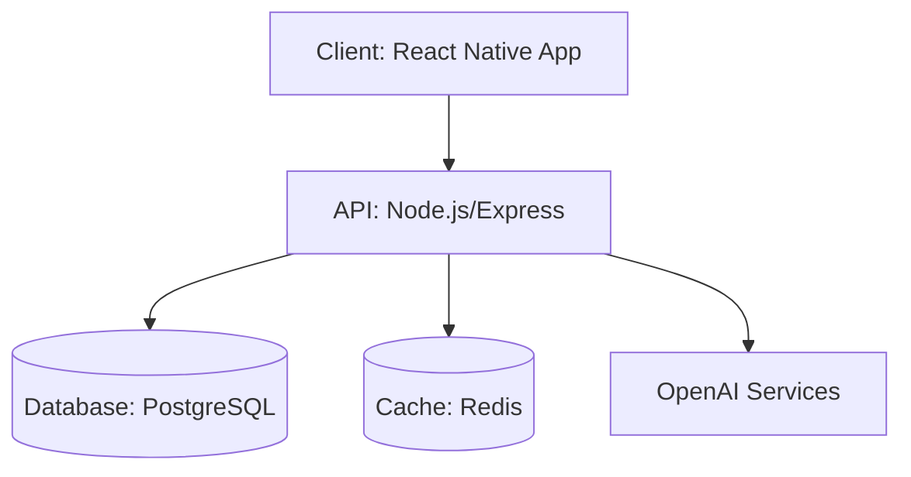

# Realtime Debate Arena
AI-moderated voice debates with live fact-checking and audience scoring

Realtime Debate Arena is a platform where users engage in structured voice debates on trending topics. Leveraging OpenAI's Realtime 2 for live moderation, fact-checking, and argument analysis, the platform ensures informative and lively debates. NVIDIA's ARM chips enable real-time speech processing on mobile devices, and AI agents orchestrate debate flows and scoring. Each debate is transformed into short-form content for viral distribution.

## Features
- Real-time voice debate matching
- AI fact-checking during speech
- Live audience voting and reactions
- Auto-generated debate highlights
- Cross-platform voice processing

## Tech Stack

### Frontend
- React Native v0.71
- Redux v4.2.0
- WebRTC v1.0.30033

### Backend
- Node.js v18.12.0
- Express v4.18.2
- Redis v7.0
- OpenAI Realtime 2 API
- OpenAI Agents SDK

### Database
- PostgreSQL v15

### Infrastructure
- AWS Elastic Beanstalk
- AWS RDS
- AWS ElastiCache
- GitHub Actions

## Architecture
Realtime Debate Arena is built with a robust architecture to handle real-time voice processing and AI-driven moderation. The client-side application uses React Native for cross-platform compatibility, while the backend is powered by Node.js and Express. Redis is utilized for real-time data processing, and PostgreSQL stores user data and debate archives. AI services are integrated via OpenAI's APIs.



## Project Structure
```plaintext
realtime-debate-arena/
│
├── frontend/
│   ├── src/
│   │   ├── components/
│   │   ├── screens/
│   │   ├── redux/
│   │   ├── assets/
│   │   ├── utils/
│   │   └── App.js
│   └── package.json
│
├── backend/
│   ├── src/
│   │   ├── controllers/
│   │   ├── models/
│   │   ├── routes/
│   │   ├── services/
│   │   └── app.js
│   └── package.json
│
├── database/
│   ├── migrations/
│   ├── seeders/
│   └── schema.sql
│
├── scripts/
│   └── deployment/
│
└── README.md
```

## Getting Started

### Prerequisites
- Node.js v18.12.0
- PostgreSQL v15
- Redis v7.0
- AWS account for deployment

### Installation

Clone the repository:

```bash
git clone https://github.com/yourusername/realtime-debate-arena.git
cd realtime-debate-arena
```

Install dependencies for both frontend and backend:

```bash
cd frontend
npm install
cd ../backend
npm install
```

### Environment Variables
Create a `.env` file in the `backend` directory, based on `.env.example`:

```
OPENAI_API_KEY=your_openai_api_key
DATABASE_URL=your_database_url
REDIS_URL=your_redis_url
```

### Running

Start the backend server:

```bash
cd backend
npm start
```

Start the frontend application:

```bash
cd frontend
npm start
```

## Documentation
- [Product Requirements](docs/PRD.md)
- [Design Brief](docs/DESIGN.md)
- [Architecture](docs/ARCHITECTURE.md)

## License
This project is licensed under the MIT License.