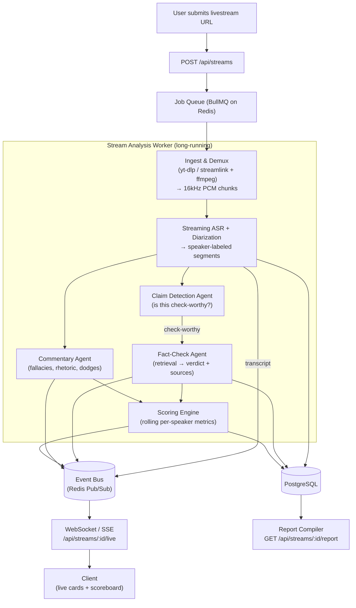

# Observer Mode — Livestream Fact-Checking & Scoring

Observer Mode extends Realtime Debate Arena from a platform where the AI *participates* (moderates a live WebRTC debate) into one where the AI *observes* an external debate from a **livestream URL**, fact-checks and comments on it in real time, and compiles a final report that scores each side and designates a "winner."

The AI never speaks into the debate. It produces a side-channel of transcript, fact-checks, commentary, and scoring that streams to viewers live and is compiled into a shareable report at the end.

---

## 1. Concept

```
Livestream URL
   → ingest audio (yt-dlp / ffmpeg)
   → transcribe + diarize (speaker-labeled segments)
   → detect check-worthy claims
   → fact-check (retrieval → verdict + sources) + commentary (fallacies, rhetoric)
   → rolling per-speaker scoring
   → live events to viewers (WebSocket)
   → final compiled report with winner
```

This reuses the existing stack's **Redis** (pub/sub fan-out + job queue) and **OpenAI Agents SDK** (multi-agent orchestration). The genuinely new infrastructure is the **ingestion worker** and the **scoring engine**.

---

## 2. Architecture



> **MVP note:** Phase 1 (this branch) runs the worker **in-process** inside the API server and uses an **in-process event bus** instead of BullMQ/Redis pub/sub. The module boundaries are drawn so the worker and bus can be moved to a separate tier later without touching the routes or client.

---

## 3. Pipeline stages

| Stage | Responsibility | MVP implementation |
|-------|----------------|--------------------|
| **Ingestion** | Resolve URL, extract audio, transcode to 16kHz mono PCM | `ffmpeg`/`yt-dlp` spawn, with a **simulation fallback** when binaries/keys are unavailable |
| **Transcription + diarization** | Speaker-labeled, timestamped segments | OpenAI transcription per window; simulated segments in fallback. Diarization is a Phase 1.5 add (Deepgram/AssemblyAI/pyannote) |
| **Claim detection** | Flag check-worthy factual claims | Phase 2 |
| **Fact-check** | Retrieve evidence → `true/false/misleading/unverifiable` + confidence + sources | Phase 2 |
| **Commentary** | Fallacies, rhetoric, dodges, contradictions | Phase 3 |
| **Scoring** | Rolling per-speaker metric scores | Phase 3 |
| **Report** | Annotated timeline + scorecard + winner | Phase 4 |

---

## 4. Scoring matrix (the "winner" rubric)

The rubric is **explicit, weighted, and configurable per session** — it is both the product's differentiator and its biggest risk surface.

| Metric | Measures | Signal source |
|--------|----------|---------------|
| **Facticity** | % of claims verified true vs. false/misleading | Fact-check verdicts + confidence |
| **Evidence quality** | Citations, data, specificity | Commentary agent |
| **Persuasiveness** | Rhetorical effectiveness, clarity | Commentary agent (LLM rubric) |
| **Responsiveness** | Did they rebut the opponent / answer the moderator? | Cross-segment analysis |
| **Coherence** | Internal consistency, no self-contradiction | Contradiction detection |
| **Composure** | Civility, staying on topic | Commentary agent |

`final_score = Σ (metric_value × weight)`. The "winner" is the higher aggregate, but the report **always** shows the per-metric breakdown and uncertainty — it is transparent analysis, not an oracle. A session can be configured to show analysis *without* declaring a winner.

---

## 5. Data model additions

```sql
stream_sessions(id, source_url, platform, status, started_at, ended_at)
transcript_segments(id, session_id, speaker_label, text, start_ts, end_ts)
claims(id, session_id, segment_id, speaker, claim_text, checkworthy)         -- Phase 2
fact_checks(id, claim_id, verdict, confidence, sources jsonb, explanation)   -- Phase 2
commentary(id, session_id, segment_id, type, text, ts)                       -- Phase 3
scores(id, session_id, speaker, metric, value, ts)                           -- Phase 3 (time series)
reports(id, session_id, winner, summary, scorecard jsonb, generated_at)      -- Phase 4
```

Phase 1 ships `stream_sessions` and `transcript_segments`.

---

## 6. API surface

| Method | Path | Description | Phase |
|--------|------|-------------|-------|
| `POST` | `/api/streams` | Create a session from `{ url, weights? }`, start the worker | 1 |
| `GET` | `/api/streams` | List sessions | 1 |
| `GET` | `/api/streams/:id` | Session status + metadata | 1 |
| `GET` | `/api/streams/:id/transcript` | Stored transcript segments | 1 |
| `POST` | `/api/streams/:id/stop` | Stop analysis | 1 |
| `WS` | `/api/streams/:id/live` | Live `session`/`transcript`/`fact_check`/`commentary`/`score_update` events | 1 |
| `GET` | `/api/streams/:id/report` | Compiled report + winner | 4 |

### Live event shapes

```jsonc
{ "type": "session",    "data": { "id": "...", "status": "live" } }
{ "type": "transcript", "data": { "speaker": "Speaker A", "text": "...", "startTs": 12.0, "endTs": 17.4 } }
{ "type": "fact_check", "data": { "claim": "...", "verdict": "misleading", "confidence": 0.78, "sources": [] } }
{ "type": "score_update","data": { "speaker": "Speaker A", "metric": "facticity", "value": 0.82 } }
```

---

## 7. Key trade-offs

- **Latency vs. accuracy** — Live fact-checking lags speech. Target a 5–15s budget, use a rolling buffer, and prioritize check-worthy claims so the queue does not fall behind during rapid exchanges (backpressure).
- **Cost** — Continuous ASR + LLM calls dominate cost. Use a cheap model for claim *detection*, a stronger one only for *verification*.
- **Legal / ToS** — Extracting audio from YouTube/Twitch may violate their terms and raises copyright questions. Prefer official APIs or streams the user owns/has rights to.
- **Bias in the "winner" call** — Mitigate with a published rubric, visible confidence/uncertainty, and a no-winner option.
- **Language choice** — The AI/ASR ecosystem is richer in Python. A Python microservice for the worker is reasonable; Phase 1 stays in Node + hosted ASR to keep one language.

---

## 8. Phasing

1. **Ingest + transcribe** *(this branch)* — URL → transcript stored in Postgres, streamed live over WebSocket. Simulation fallback so the full pipeline runs with zero external dependencies.
2. **Fact-check** — claim detection + verified verdicts with sources, rendered as live cards.
3. **Commentary + scoring** — analyst agent + rolling scoreboard.
4. **Report + winner** — compiled annotated timeline, scorecard, shareable export.

---

## 9. Phase 1 implementation map

| File | Role |
|------|------|
| `backend/src/services/sessionStore.js` | Session registry + in-process event bus (pub/sub abstraction) |
| `backend/src/services/streamIngestion.js` | Resolve URL → audio windows (ffmpeg/yt-dlp) with simulation fallback |
| `backend/src/services/transcription.js` | Audio window → transcript segment (OpenAI) with simulation fallback |
| `backend/src/services/streamAnalysisWorker.js` | Orchestrates ingest → transcribe → persist → publish |
| `backend/src/routes/streams.js` | REST endpoints for sessions/transcript |
| `backend/src/ws/liveTranscript.js` | WebSocket server bridging the event bus to clients |
| `database/migrations.js` | `stream_sessions` + `transcript_segments` tables |
